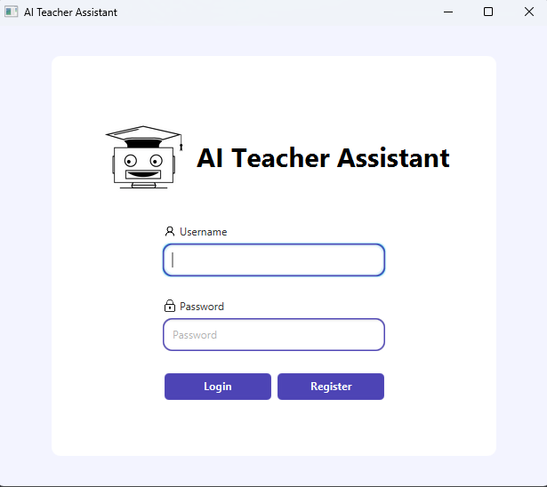
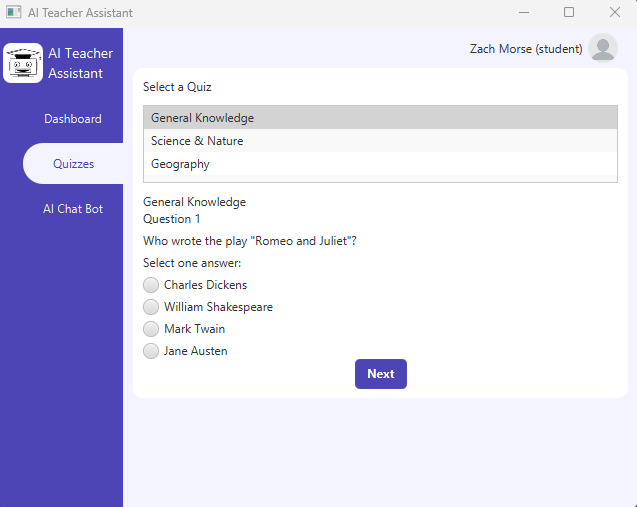
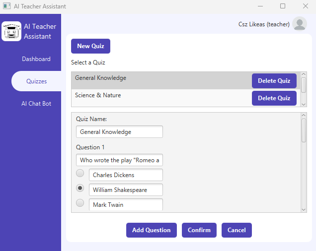

# CAB302 AI Teacher

## Overview

CAB302 AI Teacher is a JavaFX desktop application developed as a group project for the CAB302 (Artificial Intelligence) course. The application assists teachers in managing classrooms and supports AI-driven features such as quiz generation and a student chatbot.

The project was built collaboratively using Agile methodology, with a strong focus on clean architecture, object-oriented design, and real-world development practices.

---

## Screenshots

### Login Screen

### Student Dashboard

### Teacher Dashboard

---

## Key Features

### Quiz Creation & Management
- Create quizzes manually or generate them automatically
- Edit, delete, and manage quizzes as a teacher
- Students can take quizzes and receive scores

### AI Chatbot
- Students can ask questions related to course material
- Provides study support and explanations

### User Management
- Role-based access for teachers and students
- Login, registration, and profile editing
- Secure credential handling

### Classroom Workflow
- Teacher-focused management tools
- Student-focused learning interface
- Clear separation of responsibilities through MVC

---

## Technical Highlights

- **Object-Oriented Design**
  - Implemented using MVC architecture
  - Applied design patterns such as Singleton and Factory

- **Agile Development**
  - Two-week sprints
  - Task tracking via Trello
  - Regular stand-ups and meeting documentation

- **Security**
  - Passwords hashed using SHA-256
  - Email validation and strong password enforcement

- **Continuous Integration**
  - Automated Maven builds
  - Unit testing via GitHub Actions
  - Javadoc generation and deployment

---

## Tech Stack

- Java 17+
- JavaFX (UI)
- SQLite (Database)
- Maven (Build & Dependency Management)
- JUnit (Testing)
- GitHub Actions (CI/CD)

---

## My Role & Contributions

**Zach Morse** — Designer / Backend Developer

- Created low and medium fidelity UI designs
- Implemented the manual quiz creation functionality
- Contributed to backend logic and data handling
- Maintained meeting minutes and assisted with sprint organisation

This role required balancing design considerations with backend implementation while working closely with frontend and fullstack teammates.

---

## Team Contributions

This project was completed collaboratively with the following team members:

- **Kynan Stoakes** — Frontend Developer  
  UI styling, stage navigation, user detail editing, troubleshooting

- **Kenneth Lee** — Fullstack Developer  
  REST API implementation, database management, password hashing, test creation

- **Sanghun Han** — Refactorer / CI Integrator  
  Code refactoring using design patterns, GitHub Actions setup, Trello configuration

---

## How to Run the Application

1. Install **Java 17 or newer**
2. Clone the repository
3. Open the project in an IDE (e.g., IntelliJ IDEA)
4. Ensure JavaFX is properly configured
5. Run
